# Fundamentos da segurança da Informação(programa de Bolsas)

  > Módulo 0:
  # Pilares e políticas de segurança da informação
  #### Hora de balizar os fundamentos 
  ### O que é segurança da informação?
De acordo com o NIST (National Institute of Standards and Technology) a segurança da Informação é a proteção de informações e sistemas de informação contra o acesso, o uso, a divulgação, a interrupção, a modificação ou a destruição não autorizados, a fim de fornecer confidencialidade, integridade e disponibilidade.
----
### Os Pilares da segurança da informação
* Confidencialidade

Para proteger a informação de acessos não autorizados, evitando situações de ataques por acesso indevido.
O objetico é controlar o acesso por múltiplos fatores autentificação e criptografias.

 

 Tais como
 * Especificação requisitos mínimos para uma senha segura.

 * Autentificação de senha fraca.

 * identificador e gerenciador de sessões.

* Integridade
  
  Este é o pilar que devemos atender para manter as características originais dos dados, conforme sua criação.
  
  * validaçao de dados,como hashes.
  * verificação de duplicidade.
  * tratamento de dados de entrada, como caracteres especiais e comandos.

  

* disponibilidade
Demanda estável e acesso permanente ao ambiente e aos sistemas.
* Recursos de redundância, como backup de dados e balenciamento de carga;
* infraestrutura em nuvem.
  
 

  > Módulo 1:
  ### níveis de Classificação
  * Confidencial
  
  Informações altamente sigilosas
  * Restrita
  
   São informações exclusivas de alguns funcionários e/ou determinadas áreas.
  * interna
  São informações que remetem aos funcionários, estágiarios, pretadores de serviços da empresas e precisam de cuidados para evitam a divulgação externa.
* Pública
  São informações que podem ser divulgadas sem restrições para o público em geral.

  > Módulo 2
  ### Engenharia Social
  É a habilidade de conseguir acesso a informações ou áreas importantes de algo ou alguém através de habilidades de persuasão.
  ### Tácticas de abordagem
  * Baiting:
  
  uma ísca física ou digital como pendrive ou download,podem trazer malware.
  * Phishing:
  
  Criação de conteúdos enganosos.
  * Dumpster Diving:
  descuido como o descarte de informações.
  > Módulo 3
  ### Boas Práticas e diretrizes
  Conheça alguns dos dilemas de segurança mais comuns em nosso dia-a-dia e saiba como lidar da melhor maneira para evitar interrupções, destruição ou modificação não autorizados, acesso e uso indevido ao trabalho que você tem se dedicado tanto.
 (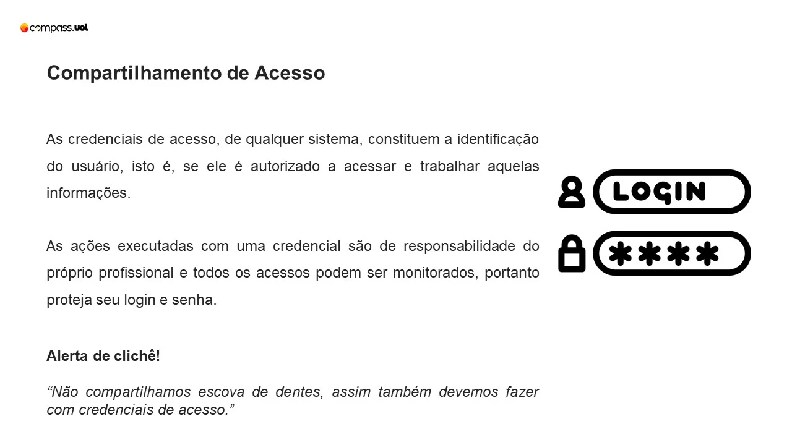
 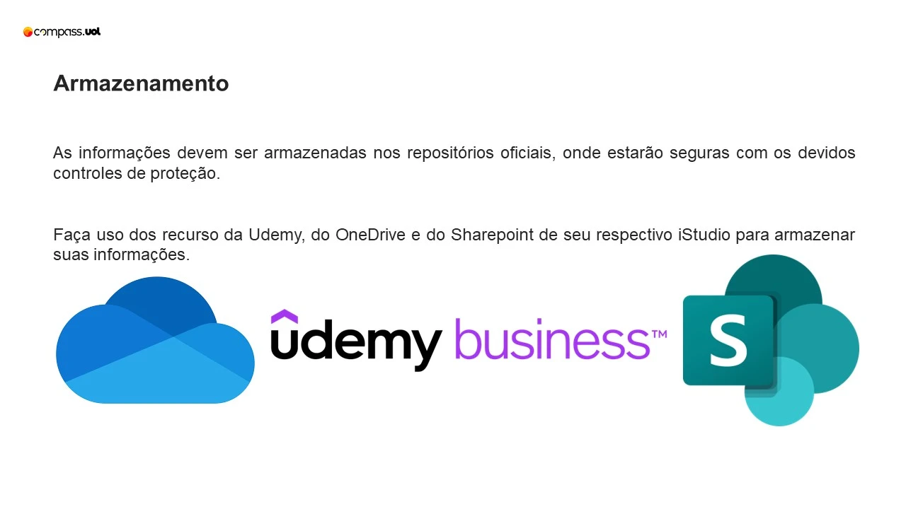
 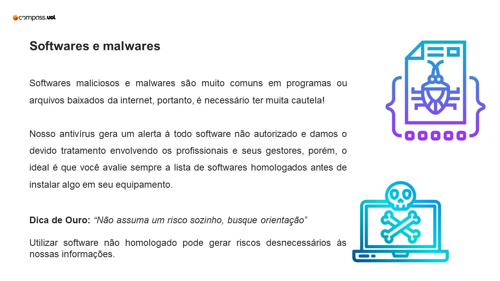
 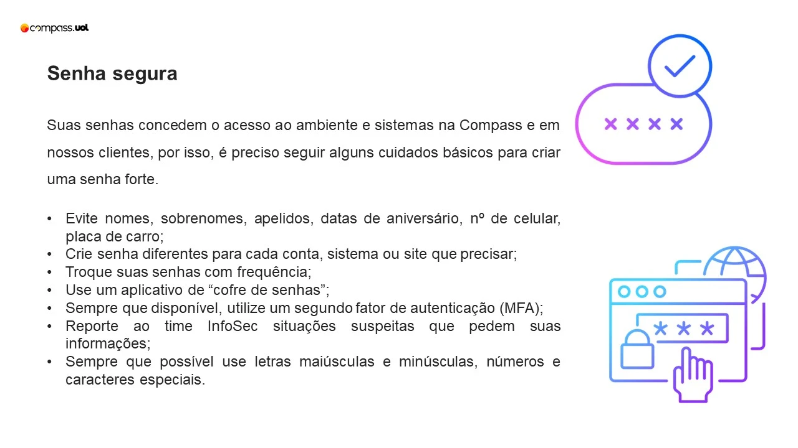
 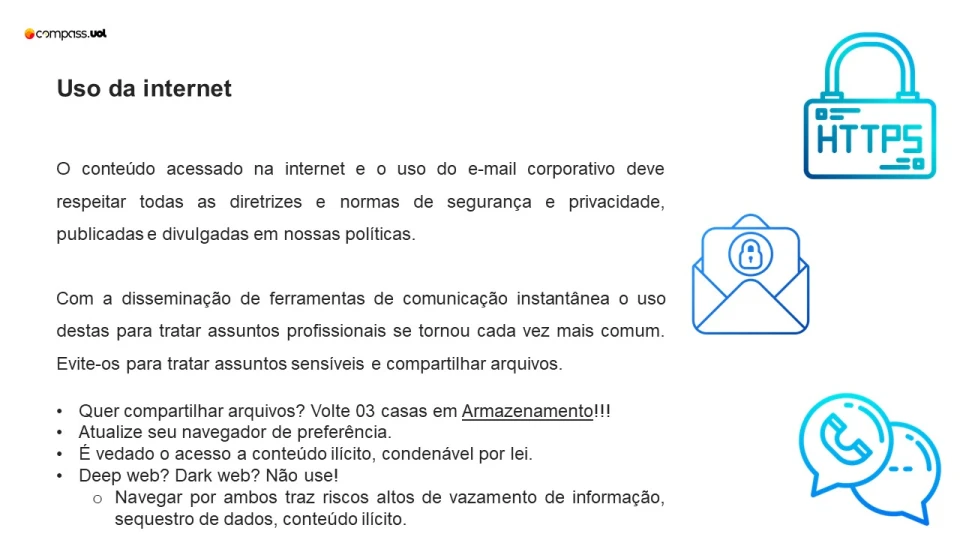

 Quando precisar trafegar informação sensível, procure pelo "cadeadinho"!

Conteúdo ilícito? Uma lista pra você se lembrar, mas não limitada a esta.

Ataques, ameaças, violência, pornografia, spoofing, sniffer, defacement, disseminação de vírus, worms, trojans, spywares, spam, roubo de informação, espionagem, sabotagem, destruição, divulgação e alteração de informações não autorizadas, pirataria, engenharia reversa e/ou depuração de código não autorizado.​​​​​​​

 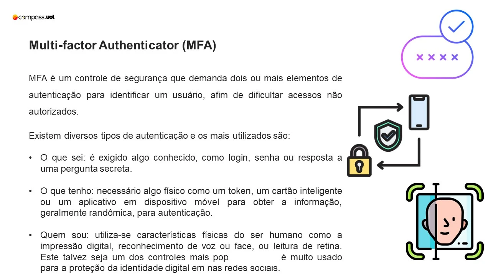
 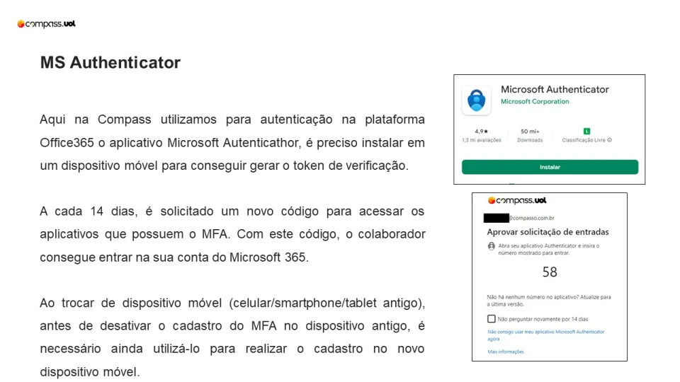
 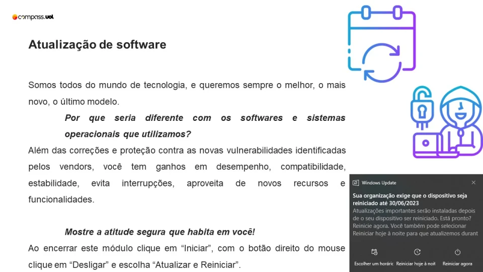
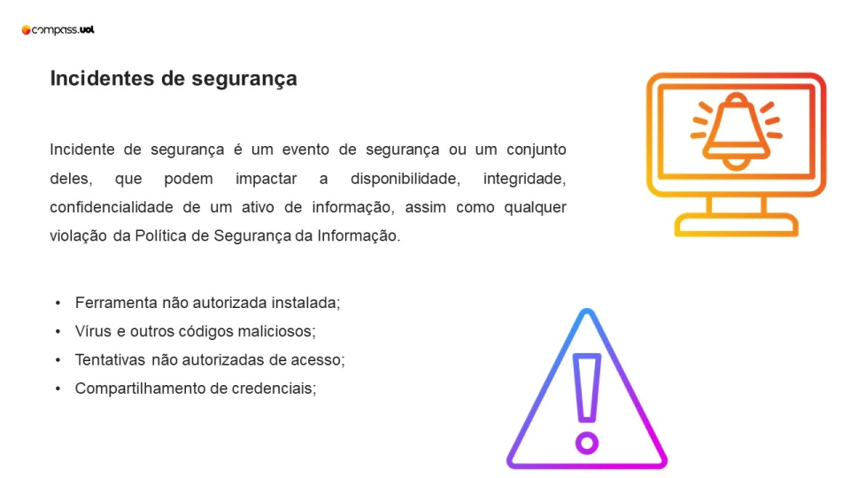
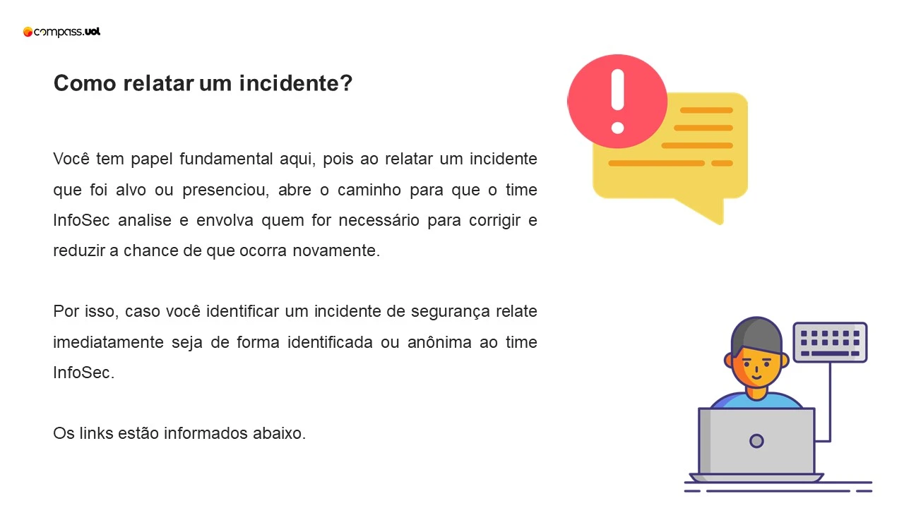
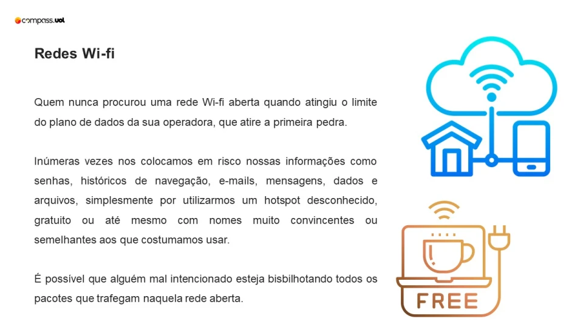
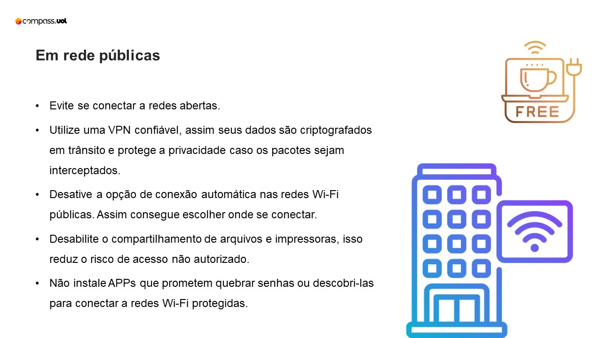
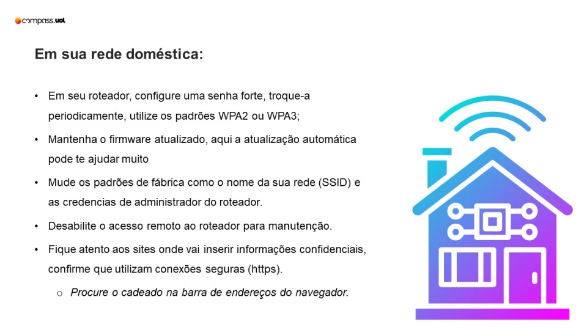